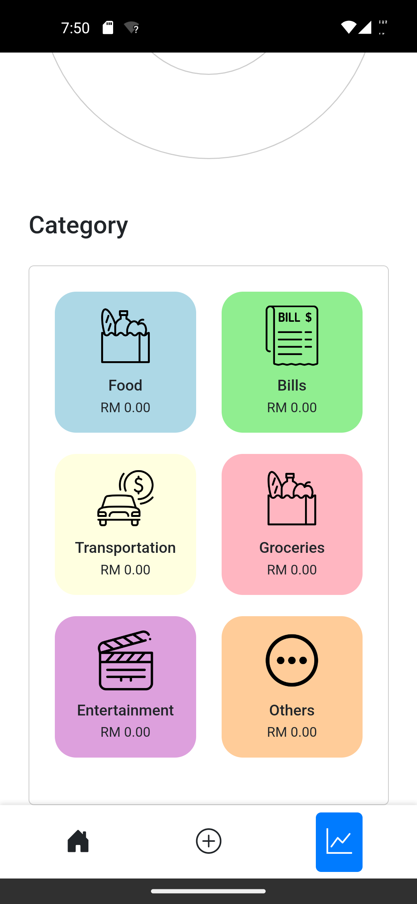

# Expense Tracker Application

## Overview

    The Expense Tracker Application is a web-based tool designed to help users manage their daily expenses efficiently. Built with HTML, CSS, JavaScript, and jQuery, the application features a user-friendly interface enhanced by Bootstrap. It allows users to add, edit, delete, and view expenses, providing secure login and signup functionality. The application stores data in local storage using JSON and presents visual data through interactive charts. This robust tool aids users in tracking and analyzing their financial habits effectively, ensuring an intuitive and seamless experience.

## [Authentication](index.html)

    The `index.html` page serves as the landing page for the Expense Tracker Application, welcoming users with the application's logo and slogan. It provides clear navigation options for users to either log in to an existing account or sign up for a new one. This page ensures an intuitive start to the user experience, guiding both new and returning users seamlessly into the application.

## [Sign Up](signup.html)

    The `signup.html` page is designed to allow new users to create an account by providing a unique username, password, and email address. This page ensures that all necessary details are collected in a user-friendly form, guiding users through the registration process smoothly. Upon successful registration, a confirmation message is displayed to the user, indicating the completion of the signup process.

### Username already exist!

    During the signup process, if the entered username already exists in the system, the application immediately notifies the user with an error message. This subpart of the signup functionality ensures that each username is unique, preventing duplication and ensuring secure, personalized user accounts.

## [Login](login.html)

    The `login.html` page provides users with a secure way to access their accounts by entering their username and password. This page ensures that only authorized users can access the application by verifying the entered credentials against the stored data. A user-friendly form is presented for easy login, ensuring a smooth authentication process.

### Credentials incorrect

    During the login process, if the entered credentials are incorrect, the application immediately notifies the user with an error message. This feature ensures that users are aware of any authentication issues and can take corrective action, enhancing the security and user experience of the application.

## [Homepage](homepage.html)

    The `homepage.html` serves as the main dashboard for users after logging in. It displays a welcome message, a summary of the user's expenses, and recent activity. This page is designed to provide a quick overview of the user's financial status, ensuring easy navigation and access to other features of the application.

## [Expense](expense.html)

    The `expense.html` page allows users to manage their expenses by adding new entries, viewing existing ones, and managing their expense records. This page provides a detailed view of all expenses, categorized and sorted by date, making it easy for users to keep track of their spending.

## [Edit or Delete Expense](editExpense.html)

    The `editExpense.html` page offers functionalities for editing or deleting existing expense entries. Users can update the details of their expenses or remove them entirely if needed. This feature ensures that users can maintain accurate and up-to-date financial records.

## [Add Expense](addExpense.html)

    The `addExpense.html` page allows users to input new expense details into the system. Users can specify the amount, date, category, and additional notes for each expense. This page is designed to be intuitive, facilitating the easy addition of new expenses to the user's financial records.

## [Statistic](statistic.html)

    The `statistic.html` page provides a visual representation of the user's expenses through various charts and graphs. Users can filter the data by month and year, allowing for detailed analysis of their spending patterns. This page helps users to gain insights into their financial habits and make informed decisions.

## Expense Category

    The header title on the expenseCategory.html page dynamically changes based on the squircle that was clicked.

## Example

